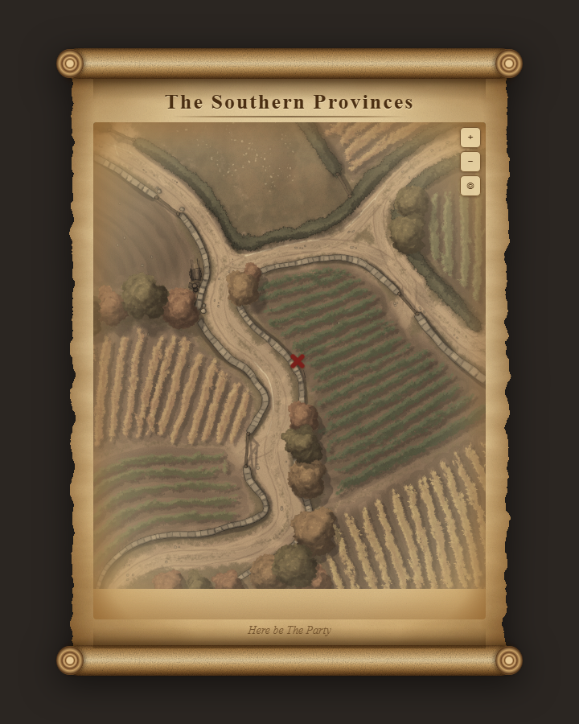

# Scorpious187's Parchment Map

A [Foundry VTT](https://foundryvtt.com) module that opens a map view styled as a rolled-up parchment scroll. A GM-configured scene is displayed with an aged-ink parchment treatment — paper grain, water stains, torn edges, rolled ends — centred on a chosen actor's token, marked with a red X.



The entire parchment look is procedural (CSS gradients + SVG turbulence/displacement filters), so the module ships no image assets and works with any game system.

## Features

- **Parchment scroll window** — frameless, resizable, draggable, with torn deckled edges and rolled top/bottom ends drawn entirely in CSS/SVG.
- **Aged map treatment** — the scene's background image is rendered as faded ink on the paper: sepia toning, parchment multiply tint, grain, and an edge vignette that blends the map into the sheet.
- **X marks the spot** — a red ink marker tracks the configured actor's token and re-centres live as it moves.
- **Pan & zoom** — drag to pan, mouse-wheel or corner buttons to zoom, one click to re-centre.
- **Sensible fallbacks** — with nothing configured, the map shows the currently viewed scene centred on each user's own character.

## Usage

1. Enable the module in your world.
2. **Settings → Configure Settings → Scorpious187's Parchment Map → Configure Parchment Map**: pick the scene to draw on the parchment, the actor whose token the map centres on, and the default zoom.
3. Open the map from the scroll button in the **Token controls** toolbar (available to players too), or via macro:

```js
game.modules.get("scorpious187s-parchment-map").api.open();
```

## Compatibility

- Foundry VTT v13 minimum, verified on v14.
- System-agnostic.

## Installation

Install via manifest URL:

```
https://github.com/nscarpinatodev/scorpious187s-parchment-map/releases/latest/download/module.json
```
